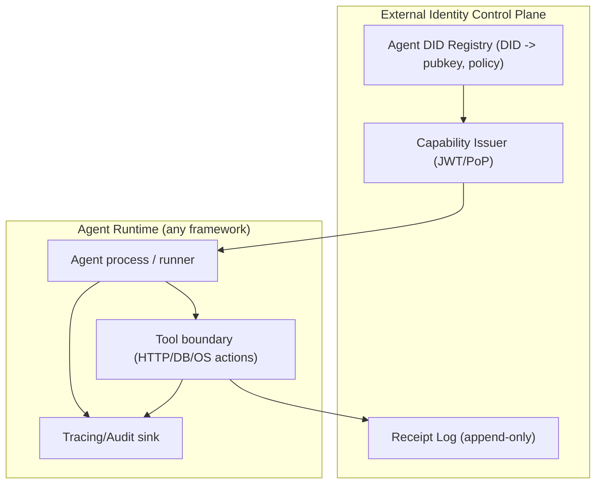

# Agent Identity Handling Across Major Agent Frameworks

## Executive summary

Across all six frameworks, “agent identity” is mostly **not a first-class, portable, cryptographic identity**. In practice, identity is usually inferred from (a) the **cloud/workload principal** running the agent (service account, managed resource identity), and/or (b) the **API key** used to call a model provider. As a result, most ecosystems offer **good operational tracing**, but **weak intrinsic agent attribution** (who/what *this* agent is) unless you impose an application-level identity layer. citeturn6view5turn6view11turn8view6turn6view10

The one meaningful exception is Google’s managed runtime for agents: **Vertex AI Agent Engine “agent identity”** can provision a **per-agent IAM principal** tied to the agent lifecycle and resource ID, positioned explicitly as more secure than reusing service accounts. This gives a native least-privilege footing and (within Google Cloud) strong audit correlation. However, it still does **not** automatically produce **cryptographic, verifiable action receipts** that travel across systems—you still need an external signing/receipt pattern if you want portable, tamper-evident attestation. citeturn6view0turn8view6turn20search2

For OpenAI and Anthropic ecosystems, “identity” is primarily **provider account → project/workspace → API key/service account**, with role-based access control (RBAC) and audit logs available at the org/workspace level. These controls are robust for enterprise governance, but they authenticate **callers**, not “agents” as sovereign actors. Agent SDKs add session/thread IDs for state and diagnostics, but these IDs are not cryptographic identities and are not directly reusable across providers. citeturn14view6turn6view4turn6view11turn6view12turn16view1turn6view2

For CrewAI, Pydantic AI, and open-source LangGraph, identity is largely an **application concern**: the frameworks provide orchestration mechanics (roles, memory scopes, run metadata, thread IDs, tool approval hooks), but the developer must supply real authentication/authorization and any portable identity scheme (DID/JWT/capability tokens). citeturn6view10turn19view0turn8view0turn6view8turn6view16turn6view1turn15view6

## Evaluation rubric and terminology

This report distinguishes five layers that often get conflated as “agent identity”:

**Workload identity**: the principal the runtime presents to infrastructure (e.g., IAM principal, service account). citeturn7view5turn8view6turn6view0

**Provider identity**: the entity authenticated to the model provider (API key, project/workspace key, provider service account). citeturn14view6turn6view11turn6view12turn8view5

**Session/run identity**: runtime correlation identifiers (thread_id, session_id, run_id) that help persistence/tracing but are not a cryptographic identity. citeturn6view1turn15view0turn21search2turn16view1turn6view2

**Authorization model**: how permissions are expressed/enforced (IAM roles, RBAC roles + scopes, approval-gated tools, policy hooks). citeturn8view9turn6view4turn6view8turn7view0turn17view3

**Cryptographic attestation**: signatures/receipts enabling third parties to verify “agent X did Y” independent of the platform logs. None of the six frameworks provide this end-to-end out of the box (Google provides an *attested* agent identity as a managed principal, which is different from signed action receipts). citeturn8view6turn6view0

## Framework analyses

### entity["company","Google Cloud","cloud platform"]: Vertex AI Agent Builder, Vertex AI Agent Engine, and the Google Gen AI SDK

**Native agent identity model**: **Yes (in Agent Engine)**; **mostly no (in SDK-only usage)**. Vertex AI Agent Engine can provision an **agent identity** described as a *per-agent identity*, tied to lifecycle and supported by IAM for governance; it is explicitly positioned as “more secure … than service accounts” and independent of the agent framework you used to build the agent. citeturn6view0turn5search2turn8view6turn20search2

**Identity primitives**

* **Agent identity (per-agent IAM principal)**: “agent identity provides a per-agent identity… tied to the lifecycle of the agent,” supported by IAM governance controls. citeturn6view0turn8view6  
* **Agent resource ID binding**: the identity is tied to the Agent Engine agent resource ID. citeturn5search2turn20search2  
* **Service accounts & service agents**: Vertex AI resources commonly run under Google-managed service accounts (“service agents”) or specified service accounts attached to resources, distinct from the creator’s identity. citeturn7view5  
* **API keys (Vertex AI “Gemini API in Vertex AI”)**: Google documents both **Application Default Credentials (ADC)** and **API keys bound to a service account** as authentication methods; it recommends API keys for testing and ADC for production. citeturn8view7turn8view8  
* **Agent Builder identity controls** (product posture): Agent Builder marketing explicitly frames “identity controls” as choosing whether agents operate with **dedicated service accounts** or “on behalf of individual users.” citeturn22view0

**Authentication mechanisms**

* **SDK to Vertex AI**: The Vertex AI quickstart describes authenticating to Vertex AI with either **ADC** or an **API key bound to a service account**. citeturn8view7turn8view8  
* **Workload-to-GCP resources**: Vertex AI resources commonly use a **resource identity** (service agent/service account) separate from the creator principal. citeturn7view5  
* **Agent Engine agent identity**: is provisioned as a managed identity for the deployed agent and is surfaced in logs across Google Cloud services (including user-delegated flows showing both user and agent identity, per the agent identity overview). citeturn0search8turn6view0

**Authorization model**

* **IAM roles and custom roles**: Vertex AI Search/Agent Builder resources use IAM with predefined and custom roles for Discovery Engine / Vertex AI Search. citeturn8view9  
* **Agent Engine least-privilege**: agent identity is described as enabling a least-privilege approach and supported by IAM governance controls. citeturn6view0turn8view6  
* **Operationally managing access**: the “Managing access for deployed agents” guide describes finding the principal (service account used as agent identity) and granting/revoking IAM roles for that principal. citeturn7view6  
* **First-class IAM principal framing**: Google’s blog positions agent identities as “first-class IAM principals” enabling least-privilege and granular policies/boundaries. citeturn22view4

**Persistence and portability**

* **Persistence**: Agent identity is tied to the agent lifecycle and resource ID; this is **persistent within Google Cloud** so long as the agent resource exists. citeturn6view0turn5search2  
* **Portability limits**: It is not inherently portable across non-GCP systems; it is an IAM principal inside Google’s trust domain (you can map it outward, but mapping is external design). citeturn8view6turn6view0

**Cryptographic attestation**

* **“Attested” identity exists** at the workload-identity layer (“agent identities… are attested and tied to the lifecycle of the agents”), but this is not the same as signed tool-call receipts consumable cross-system. citeturn8view6  
* No default mechanism (in the surfaced docs) for signing each action/tool call in a verifiable, portable format.

**Auditability/logging**

* **Cloud Audit Logs for Agent Builder**: Google documents audited methods for Vertex AI Agent Builder and how to view those audit logs by filtering on the service name. citeturn8view10  
* **Cross-service log correlation**: agent identity is described as viewable in logs across Google Cloud services. citeturn0search8turn6view0

**Recommended integration patterns**

Within Google’s stack, a pragmatic “portable agent identity” pattern is to treat **Agent Engine agent identity as the workload root of trust**, then overlay a **capability token** for outbound tool calls:

* Bind a DID/JWT “agent passport” to the agent identity principal (issuer = your org, subject = agent DID; include the GCP principal as a claim).  
* Enforce tool access by IAM where possible (e.g., Secret Manager / BigQuery / Storage) plus application-level capability tokens for non-GCP calls.  
* Emit signed receipts **outside** GCP logs (e.g., sign `{tool, args_hash, result_hash, timestamp, agent_did, gcp_principal, trace_id}`) and store alongside Cloud Audit Logs correlation IDs.

**Practical implications/risks**

Google’s approach is the strongest option among the six for **least-privilege per agent** and central governance—especially in regulated environments—because the agent can be a distinct IAM principal with separable roles. The main gap is portability: without an additional layer you cannot easily prove to an external party that “this agent” performed a given action beyond trusting Google’s audit trail. citeturn6view0turn8view6turn8view10

### entity["company","CrewAI","agent orchestration framework"]: role-based multi-agent orchestration

**Native agent identity model**: **No** (identity is descriptive/configurational). CrewAI defines an `Agent` with behaviors and capabilities; the public docs describe agents as units that make decisions based on **role and goal**, can use tools, maintain memory, and delegate tasks. citeturn6view10turn20search1

**Identity primitives**

* **Role/goal/backstory**: core descriptive attributes used to shape behavior, not a cryptographic identity. citeturn6view10turn19view0  
* **Memory scopes**: CrewAI memory supports hierarchical “scopes” that can be agent-scoped (e.g., `/agent/researcher`). This is a useful *internal namespacing identity primitive* for isolating context, but it is not authentication. citeturn19view0  
* **Enterprise integration token**: for CrewAI Enterprise integrations, docs instruct setting an “Enterprise Token” in an environment variable. This is a provider/platform credential rather than an agent identity. citeturn8view11

**Authentication mechanisms**

CrewAI itself does not provide a native user/agent authentication plane in the documentation surfaced here; authentication is typically inherited from whatever services/tools you integrate (model provider keys, DB credentials, etc.). The only explicit credential in CrewAI first-party docs in this dataset is the **Enterprise integration token** for platform integrations. citeturn8view11

**Authorization model**

CrewAI’s core concept docs emphasize delegation “when allowed” but do not define a formal RBAC/IAM scheme. Enforcement is usually implemented in the surrounding application or inside tool wrappers (e.g., computing whether to execute a tool and with which credential). citeturn6view10turn19view0

**Persistence and portability**

* **Memory persistence** exists (shared crew memory or agent-scoped memory), and CrewAI explains that agents can share the crew’s memory or receive scoped private memory. citeturn19view0  
* These scopes are portable only in the sense that you can adopt the same naming conventions across systems; there is no built-in global agent ID standard in the CrewAI docs. citeturn19view0turn6view10

**Cryptographic attestation**

No native signing or verifiable action receipt mechanism is described in the referenced CrewAI docs.

**Auditability/logging**

CrewAI has two relevant observability channels:

* **Anonymous telemetry**: CrewAI states it uses anonymous telemetry and claims it does not collect prompts, task descriptions, backstories/goals, tool usage, API calls, responses, secrets, etc. citeturn6view9  
* **Telemetry disable switches**: the official telemetry page describes disabling telemetry via `CREWAI_DISABLE_TELEMETRY` or disabling all OTel with `OTEL_SDK_DISABLED`. citeturn21search3

However, there are persistent community reports/bugs alleging telemetry still being sent despite disable flags or other surprises in production environments, which creates a real operational and governance risk surface even if the intent is benign. citeturn21search23turn21search15turn21search11

**Recommended integration patterns**

CrewAI’s best extension point for identity is typically the **tool boundary** and **observability instrumentation**:

* Attach a DID/JWT capability token to each tool execution decision (as part of your tool wrapper).  
* Use memory scope naming (`/agent/<name>`) as a stable internal identifier, but do not treat it as authentication. citeturn19view0  
* Emit OpenTelemetry attributes “agent_did”, “tenant_id”, “capability_id”, etc., into spans (either via your own OTel setup or downstream APM), and disable/redirect CrewAI’s telemetry as required by policy. citeturn21search3turn21search11turn6view9

**Practical implications/risks**

CrewAI makes it easy to define “who should do what” via role/goal/backstory, but that is not a security boundary. Without a dedicated identity and authorization layer, “agent identity” becomes ambiguous in audits (“which agent instance used which credential to call which external system?”). Telemetry behavior (and disabling behavior) should be validated during security review because it can affect compliance posture and incident response. citeturn6view10turn6view9turn21search3turn21search23

### entity["company","Pydantic","python tooling company"]: Pydantic AI agents framework

**Native agent identity model**: **Partial (run-level identity), but not agent-level sovereign identity**. Pydantic AI provides structured “agent runs” with **run metadata** and a **run_id**, which helps correlate executions. It does not define a DID-like persistent agent identity that travels across systems by default. citeturn8view0turn21search2turn21search26

**Identity primitives**

* **run_id**: Pydantic AI exposes a `run_id` described as “the unique identifier for the agent run.” citeturn21search2  
* **Run metadata**: Pydantic AI allows tagging each run with contextual details such as a tenant ID; metadata is attached to `RunContext` and can be added to span attributes when instrumentation is enabled. citeturn8view0  
* **Dependencies (deps)**: Dependencies can include API keys and clients (e.g., `api_key` and `http_client`) and are passed into the agent via `deps_type`. This is a key design feature for multi-tenant identity and credential separation—if you structure it that way. citeturn12view0  
* **Tool metadata**: Tools can include metadata “not sent to the model” but usable for filtering/behavior customization—useful for policy labels (e.g., sensitivity, required capability). citeturn12view1

**Authentication mechanisms**

Pydantic AI itself is provider-agnostic; authentication typically occurs at:

* the model provider layer (via your provider client/config), and  
* your tool layer (HTTP auth, DB auth), often supplied through `deps`. citeturn12view0turn12view1

**Authorization model**

Pydantic AI provides a notable built-in authorization *primitive* at the tool boundary:

* **Human-in-the-loop tool approval**: a tool can be marked `requires_approval=True`. citeturn6view8turn12view1  
* **Deferred tools**: Pydantic AI explicitly supports scenarios where a tool call must not execute inside the same run (approval required, external system required, or too slow), returning “deferred” tool call requests. citeturn12view3turn20search7turn6view8

This is powerful for safety and least privilege, but it is not a complete IAM/RBAC system; you still need a policy engine that decides which approvals are required for which identities and contexts.

**Persistence and portability**

Pydantic AI supports durability via integrations:

* **Durable Execution with DBOS**: Pydantic AI documents durable execution that checkpoints workflow state in a database and resumes after failures. citeturn6view7turn2search1  
* Because Pydantic AI exposes run IDs and metadata, it is relatively straightforward to propagate portable identifiers, but portability is an overlay you implement (e.g., mapping agent instances to stable IDs). citeturn21search2turn8view0turn12view0

**Cryptographic attestation**

No native signing or verifiable receipt mechanism is described in the referenced official docs.

**Auditability/logging**

* **Logfire integration**: Pydantic AI offers built-in (optional) support to send detailed run traces to Logfire, emitting spans for each model request and tool call. citeturn6view6turn8view0  
* Because run metadata is attached to run spans, you can correlate tenant/user/agent identifiers in standard OTel pipelines. citeturn8view0turn6view6

**Recommended integration patterns**

Pydantic AI is one of the easiest of the six to retrofit with a capability-based identity overlay:

* Set `run metadata` to include `tenant_id`, `user_id`, `agent_did`, and a `capability_id`, and configure OTel/Logfire to record these attributes for correlation. citeturn8view0turn6view6  
* Use `deps` for per-tenant/per-agent credentials (avoid shared API keys in global state). citeturn12view0  
* Use `requires_approval` + deferred tools for high-risk actions; implement a verifier that checks a signed approval artifact before resolving the deferred tool call. citeturn6view8turn12view3turn20search7

**Practical implications/risks**

Without explicit multi-tenant discipline (separating deps per tenant and tagging runs), it’s easy to accidentally run tools with the wrong credentials. Conversely, with careful use of deps + run metadata + deferred tool approvals, Pydantic AI gives a strong foundation for auditability and for adding a DID/JWT layer without fighting the framework. citeturn12view0turn8view0turn6view8turn6view6

### entity["company","OpenAI","ai platform provider"]: OpenAI Agents SDK

**Native agent identity model**: **No (agent is a configuration), but strong org/project identity on the platform**. The “agent” is an SDK object configured with model + instructions + tools, while authentication and authorization occur at the **OpenAI platform identity** layer (org/project, API keys, service accounts, roles). citeturn21search13turn14view6turn8view5turn6view4

**Identity primitives**

* **API keys (Bearer)**: OpenAI’s API reference states the OpenAI API uses API keys via HTTP Bearer authentication. citeturn14view6  
* **Project IDs / Organization IDs**: the API overview shows optional headers to specify organization and project in requests. citeturn14view6  
* **Project service accounts**: OpenAI documents creating a project service account, which returns an unredacted API key (service-account key). citeturn8view5turn13view7  
* **Project service account scope**: OpenAI help docs state project-level service accounts are unique to the project and can’t be used outside it. citeturn13view7  
* **Agents SDK correlation IDs**: the SDK supports “thread_id” patterns (userland) and can group traces with `group_id` (example usage sets `group_id` to a thread ID). citeturn6view2turn21search0  
* **Conversation state IDs**: the Agents SDK docs describe using server-managed conversations (e.g., `conversation_id`) and response chaining with `previous_response_id`. citeturn6view2turn21search21

**Authentication mechanisms**

* API calls authenticate via **Bearer API key**. citeturn14view6  
* Organization audit log calls in the API reference demonstrate using an **admin key** (`Authorization: Bearer $OPENAI_ADMIN_KEY`) for audit logs. citeturn14view5turn8view2

**Authorization model**

OpenAI’s platform authorization is relatively explicit:

* **RBAC**: effective permissions are the union of org+project roles; for project API keys, the key’s permissions must be allowed and the user must also have a project role granting them. citeturn6view4turn8view4  
* **Key scopes**: audit log schema includes API key “scopes” in key creation/update events (e.g., `["api.model.request"]`). citeturn14view4  
* **Audit logs actor typing**: audit logs identify actor as either `session` or `api_key`, and when `api_key` they include api_key tracking id and whether it is user or service account; when `session`, they include IP address and user identity. citeturn14view0turn14view3

**Persistence and portability**

* **Local session persistence**: Agents SDK provides sessions that automatically maintain conversation history across multiple runs (e.g., SQLite-backed sessions). citeturn21search1turn6view2  
* **Server-managed conversation state**: the SDK documents letting OpenAI manage conversation state via conversation IDs. citeturn6view2turn21search21  
* **Portability**: API keys/service accounts are OpenAI platform–specific credentials; trace IDs, group IDs, and conversation IDs are also platform-specific correlation IDs rather than portable agent identities. citeturn14view6turn6view2turn21search0

**Cryptographic attestation**

No native per-action signing/receipts are indicated in the core SDK/platform docs cited here. Audit logs provide strong internal attribution, but external verifiability requires an overlay.

**Auditability/logging**

OpenAI offers two audit channels:

* **Agents SDK tracing**: SDK records events during an agent run (LLM generations, tool calls, handoffs, guardrails, custom events) and is enabled by default. citeturn6view3turn20search32  
* **Sensitive data logging controls**: Agents SDK defaults to not logging model/tool inputs and outputs, controlled by environment variables. citeturn8view1  
* **Organization audit logs API**: audit logs endpoint exists under `/organization/audit_logs`; sample request uses an admin key, and schema includes actor/session fields and event types. citeturn8view2turn14view5turn14view0turn14view3

**Recommended integration patterns**

OpenAI’s platform makes it practical to implement “agent identity” as **project service account per agent** plus **capability tokens** at tool boundaries:

* Create a dedicated project service account (and API key) per agent or per agent class to improve blast-radius and audit attribution. citeturn8view5turn13view7turn8view4  
* Use Agents SDK tracing `group_id` to attach your `agent_did` or conversation thread ID, and set trace metadata to include a capability token identifier (so internal traces correlate to your external identity layer). citeturn21search0turn6view2turn6view3  
* For external tools, enforce signed capability JWTs inside your tool implementations; write signed receipts and include OpenAI trace IDs for linkage.

**Practical implications/risks**

OpenAI’s platform identity model is strong at the **org/project boundary**, but absent an overlay you cannot easily distinguish “Agent A” and “Agent B” if both share the same project key. Audit logs may attribute actions to a session or API key, but not to a particular “agent configuration” unless you isolate keys or include correlation metadata consistently. citeturn14view0turn14view3turn6view4turn6view2

### entity["company","LangChain","developer tools company"]: LangGraph

**Native agent identity model**: **No (open-source library)**; **Yes at the deployment/API layer (LangGraph Platform / LangSmith Deployment)**. The LangGraph open-source library focuses on graph execution and state; authentication/authorization concerns are outside the library unless you adopt the hosted/self-hosted deployment product that provides auth hooks.

* LangChain’s docs explicitly note that “custom authentication” guidance “does not apply to isolated usage of the LangGraph open source library in your own custom server.” citeturn6view16  
* Conversely, LangChain’s blog describes custom authentication and resource-level access control for LangGraph Platform (renamed later to LangSmith Deployment). citeturn15view4turn15view5

**Identity primitives**

* **thread_id**: in LangGraph checkpointing reference, `thread_id` is the primary key for storing/retrieving checkpoints; it is required for saving state, resuming, and time-travel debugging. citeturn6view1  
* **Thread as multi-tenant container**: LangGraph.js checkpoint docs describe a “thread” as a unique ID assigned to a series of checkpoints, essential for multi-tenant apps, requiring `thread_id` and optionally `checkpoint_id`. citeturn15view6  
* **RunnableConfig**: LangGraph nodes take a `RunnableConfig` that can include `thread_id` and tracing tags. citeturn7view2  
* **Deployment thread objects**: LangChain “Use threads” docs describe threads as persistent conversation containers with unique thread IDs and metadata. citeturn15view0

**Authentication mechanisms**

* **Open-source LangGraph**: no native authentication is asserted in the cited docs; you implement it in your server/middleware. citeturn6view16  
* **Deployment product**: the resource authorization tutorial explicitly references validating **bearer tokens** in incoming requests using an Auth object. citeturn7view1turn15view3

**Authorization model**

In the deployment product (LangGraph Platform / LangSmith Deployment):

* **Authorization handlers** exist at global/resource/action granularity; the most specific handler wins. citeturn7view0  
* Example enforcement patterns check permissions (e.g., `"threads:write"`) and raise unauthorized errors. citeturn13view10  
* Resource-level access control patterns include tagging resources with owner user ID and filtering threads so users only see their own. citeturn7view1turn15view3

**Persistence and portability**

* Thread IDs are persistent identifiers for state in checkpoint stores; portability depends on whether you control the thread namespace and storage. citeturn6view1turn15view6turn15view0  
* Thread IDs are not, by themselves, authenticated: if you allow clients to choose `thread_id` without binding it to a validated principal, you risk cross-tenant access.

**Cryptographic attestation**

No built-in signed action receipts; any cryptographic proof must be added at the tool boundary or API layer.

**Auditability/logging**

The cited LangChain materials emphasize threads, resource auth, and authorization flow diagrams at the deployment layer, not cryptographic receipts. The open-source library provides the `thread_id`/checkpoint model for replayability and debugging, which supports *operational audit trails* if paired with secure access control. citeturn6view1turn15view6turn7view1

**Recommended integration patterns**

LangGraph’s natural integration point is the **deployment API auth layer + thread_id discipline**:

* Treat `thread_id` as a server-issued identifier; bind it to `user_id`/`tenant_id` via authenticated bearer tokens and authorization handlers. citeturn7view1turn15view0turn6view16  
* Embed `agent_did` and capability constraints in bearer tokens, and attach them as metadata to thread resources for filtering. citeturn7view1turn7view0  
* In open-source-only deployments, implement middleware that validates JWTs and enforces “thread ownership” before passing config to the graph runner. citeturn6view16turn7view2

**Practical implications/risks**

LangGraph’s separation of “state identity” (thread IDs) from “security identity” is powerful but dangerous: thread IDs enable multi-tenant memory, but without strict binding to authenticated principals you can create inadvertent cross-tenant state exposure. The deployment/auth product helps by providing authorization hooks and resource owner filtering patterns. citeturn7view1turn6view1turn15view6turn6view16

### entity["company","Anthropic","ai platform provider"]: Claude Agent SDK

**Native agent identity model**: **Session-centric identity (session_id), but not sovereign/portable agent identity**. The SDK’s first-class correlation concept is the **session**, with `session_id` appearing in message/result structures and hook inputs, and the platform’s identity is primarily **API key scoped to workspace**. citeturn16view1turn6view12turn6view11turn17view2

**Identity primitives**

* **API key for Claude API**: the Claude API requires headers including `x-api-key` and `anthropic-version`. citeturn6view11  
* **Workspace scoping**: API keys are scoped to a specific workspace and only access resources in that workspace (files, batches, skills; prompt caches isolated per workspace starting Feb 5, 2026 per docs). citeturn6view12  
* **Console RBAC**: Claude Console roles include Developer/Admin roles that can manage API keys, and users without permissions cannot view keys/logs. citeturn18view0turn18view2  
* **session_id**: the Agent SDK Python reference defines `session_id` on result messages and stream events; hook inputs include `session_id` and transcript paths. citeturn16view1turn16view3  
* **tool_use_id / parent_tool_use_id**: tool blocks include IDs; stream events can include `parent_tool_use_id` for subagent context. citeturn16view4turn16view1turn17view2

**Authentication mechanisms**

* **Claude API**: `x-api-key` header authenticates requests. citeturn6view11  
* **Agent SDK guidance**: Agent SDK overview states third-party developers should use API key authentication methods described in the docs (and not claude.ai login/rate limits without approval). citeturn18view3

**Authorization model**

Claude Agent SDK exposes meaningful tool-governance primitives:

* **allowed_tools + permission_mode**: Python reference shows configuring an agent session with allowed tools and a permission mode. citeturn17view0turn17view1  
* **Hooks with permission decisions and input modification**: hooks infrastructure supports tool-based hooks (e.g., `PreToolUse`) and permission decisions (allow/deny) with reasons; modifications require returning `permissionDecision: 'allow'`. citeturn17view3turn17view4turn6view13  
* **Subagent permissions**: docs explicitly state subagents do not automatically inherit parent permissions and may request permissions separately; they recommend using hooks or permission rules to avoid repeated prompts. citeturn17view3turn16view2

This is closer to a capability gate than most agent SDKs, but enforcement is still an SDK/runtime policy—portable authorization still requires your system’s tokens and verification.

**Persistence and portability**

* The Python reference includes a “conversation session” model and notes Claude remembers previous messages “in this session,” and supports starting a new session by reconnecting to clear context. citeturn16view0turn17view0  
* Session IDs and transcript paths support local audit correlation, but they are not portable agent identities and do not imply cross-system trust. citeturn16view1turn16view3

**Cryptographic attestation**

No official documentation in the cited sources describes signing tool calls or generating verifiable receipts. The Python reference shows a `signature` field on a “thinking” block, but the docs excerpt does not define this as a portable attestation mechanism for actions. citeturn17view2

**Auditability/logging**

* **Hooks can log all tool usage for auditing** (explicitly shown in the Python reference’s hook usage example). citeturn6view14turn4search6  
* Hook inputs include `session_id` and transcript path, enabling structured capture of “what happened” per session. citeturn16view1turn16view3

**Recommended integration patterns**

Claude Agent SDK has unusually strong interception points for identity overlays:

* Use hook inputs’ `session_id` and transcript paths as correlation anchors; include `agent_did` and `capability_id` in your own structured logs. citeturn16view3turn16view1  
* Enforce capability tokens inside `PreToolUse` hooks: validate a JWT/PoP token bound to agent_did; deny tool use if scope/limits don’t match the requested tool. citeturn17view3turn6view13  
* For subagents, explicitly propagate constraints since subagents don’t inherit permissions by default. citeturn17view3turn16view2

**Practical implications/risks**

Claude Agent SDK’s session/tool governance is strong for local safety and auditing, but the provider identity is still primarily API key/workspace scoped. Without per-agent key isolation or an external DID/capability layer, you may have difficulty attributing an action to a stable agent identity over time—especially across environments and tool backends. citeturn6view11turn6view12turn16view1turn17view3

## Cross-framework comparison

| Framework | Native agent identity model | Main identity primitives exposed | Auth mechanism (most common) | Authorization model | Persistence & portability | Cryptographic attestation | Auditability/logging highlights |
|---|---|---|---|---|---|---|---|
| Google Vertex AI Agent Engine / Agent Builder / GenAI SDK | **Yes in Agent Engine**; SDK-only: mostly no | Agent identity (IAM principal), service accounts/service agents, API keys bound to service account, agent resource ID | ADC or service-account-bound API key to Vertex AI citeturn8view7turn8view8 | IAM roles/custom roles; per-agent least privilege; manage IAM roles for agent principal citeturn6view0turn7view6turn8view9 | Identity tied to agent lifecycle/resource ID; portable only via mapping citeturn6view0turn5search2 | “Attested” managed identity, but no action receipts citeturn8view6 | Cloud Audit Logs for Agent Builder; agent identity visible in logs citeturn8view10turn6view0 |
| CrewAI | No | Role/goal/backstory; memory scopes `/agent/...`; enterprise integration token | External (provider keys, tool credentials); enterprise token for integrations citeturn8view11turn6view10 | Mostly application/tool-wrapped policy; delegation “when allowed” (not IAM) citeturn6view10 | Memory scopes and shared memory (framework-level), no global agent ID citeturn19view0 | None native | Telemetry (claims no prompts/etc) + disable flags; community reports of telemetry issues citeturn6view9turn21search3turn21search23 |
| Pydantic AI | Partial (run-level IDs), not agent-level sovereign identity | run_id, run metadata (tenant tagging), deps (credentials), tool metadata, deferred tool IDs citeturn21search2turn8view0turn12view0turn20search7 | External/provider-specific; creds injected via deps citeturn12view0 | Tool approval (`requires_approval`), deferred tools, external policy engine citeturn6view8turn12view3turn12view1 | Durable execution via DB checkpointing; portability via metadata/IDs you propagate citeturn6view7turn8view0turn21search2 | None native | Optional Logfire: spans per model/tool call; metadata attaches to spans citeturn6view6turn8view0 |
| OpenAI Agents SDK | No (agent-as-config), but strong platform identities | API key (user/service acct), project/org IDs, admin key, tracing group_id/thread ideas, conversation_id/previous_response_id citeturn14view6turn13view7turn6view2turn21search0 | Bearer API key; admin key for audit logs citeturn14view6turn14view5 | RBAC + endpoint scopes; key perms + user role intersection citeturn6view4turn14view4 | Sessions (local) and server-managed conversation state; not portable identity citeturn21search1turn6view2 | None native | Agent tracing enabled by default; audit logs API with actor/session/ip data citeturn6view3turn14view0turn14view3turn14view5 |
| LangGraph (open-source + deployment product) | Open-source: no; deployment/API layer: yes | thread_id/checkpoint_id; RunnableConfig; bearer-token Auth in deployment product citeturn6view1turn15view6turn7view1turn6view16 | Open-source: external; deployment: bearer token auth function citeturn6view16turn7view1 | Authorization handlers (global/resource/action) + owner tagging/resource filters citeturn7view0turn7view1 | thread_id persists state (multi-tenant); portability depends on namespace control citeturn6view1turn15view0 | None native | Thread model enables operational audit; deployment tutorials show authorization flow citeturn15view0turn7view1 |
| Anthropic Claude Agent SDK | Session-centric (session_id), not sovereign/portable identity | x-api-key; workspace-scoped keys; session_id; tool_use_id; transcript_path; subagent context citeturn6view11turn6view12turn16view1turn16view3turn17view2 | x-api-key (Claude API) citeturn6view11 | allowed_tools + permission_mode; hooks allow/deny + tool logging; subagents don’t inherit perms citeturn17view0turn17view3 | Session remembers context; workspace scoping for API resources; not portable identity citeturn17view0turn6view12 | None native | Hooks can log tool usage for auditing; transcript paths & session IDs aid correlation citeturn6view14turn16view1turn16view3 |

## Reference identity adapter design

This section proposes a provider-agnostic identity overlay that can sit above any of the six frameworks. It is designed to produce **(a) portable agent identity** and **(b) enforceable tool capabilities**, while still leveraging each framework’s native correlation hooks: Google IAM principals, OpenAI trace group IDs + audit logs, LangGraph thread IDs + auth handlers, Claude session/hooks, and Pydantic AI run IDs/metadata. citeturn6view0turn21search0turn6view1turn16view1turn8view0

### Identity flow diagrams

The concrete “OBS” sink differs per framework: Cloud Audit Logs and agent identity in Google, Traces dashboard + audit logs in OpenAI, thread-based records in LangGraph deployments, session transcript/hook logs in Claude Agent SDK, and OTel/Logfire spans + run_id in Pydantic AI. citeturn8view10turn6view0turn6view3turn14view5turn7view1turn16view3turn6view6turn21search2

### Adapter fields and verification steps

| Component | Field(s) | Suggested format | Purpose | Where to attach (by framework) |
|---|---|---|---|---|
| Agent identifier | `agent_did` | DID URI (e.g., `did:key:...` or `did:web:...`) | Stable, portable agent identity | Pydantic run metadata citeturn8view0; OpenAI trace metadata/group_id citeturn21search0; LangGraph thread metadata/owner tag citeturn7view1; Claude hook context/session logs citeturn16view3; Google resource labels + logs citeturn6view0 |
| Runtime binding | `workload_principal` | `gcp_principal` / `service_account_email` / `api_key_id` | Connect portable DID to actual runtime identity | Google agent identity principal citeturn7view6turn6view0; OpenAI audit logs actor.api_key.id/service_account.id citeturn14view0 |
| Capability token | `cap_jwt` | JWT (PoP recommended) with claims: `sub=agent_did`, `aud=tool`, `scope=[...]`, `exp`, `jti`, limits | Fine-grained authorization for tools | Validate inside Claude `PreToolUse` citeturn17view3; Pydantic tool wrappers + deferred tools citeturn12view3turn6view8; LangGraph auth handlers citeturn7view0; OpenAI tool implementations + traces citeturn6view3 |
| Action receipt | `receipt_sig`, `args_hash`, `result_hash`, `timestamp`, `cap_jti` | Signed JSON (JWS/COSE) | Verifiable “agent did action” record | Store alongside: Google Cloud logs citeturn8view10; OpenAI trace IDs/group citeturn21search0; Claude transcript_path/session_id citeturn16view1turn16view3; LangGraph thread_id/checkpoint_id citeturn6view1turn15view6 |
| Correlation IDs | `trace_id`, `group_id`, `thread_id`, `session_id`, `run_id` | Framework-native strings/UUIDs | Join your receipts with vendor traces/audit | OpenAI `group_id` citeturn21search0; LangGraph `thread_id` citeturn6view1; Claude `session_id` citeturn16view1; Pydantic `run_id` citeturn21search2 |

A typical **verification sequence** for a high-risk tool call would be:

1) Validate JWT signature and expiry; confirm `sub` is a known `agent_did`.  
2) Enforce scopes/limits (`scope` includes tool name or class; optional spend/time/IP constraints).  
3) Execute tool; hash request/response; emit receipt signed by agent or by a trusted attester service.  
4) Record receipt + correlation IDs in your append-only log; mirror identifiers into tracing spans and platform logs (where supported). citeturn8view0turn6view3turn16view3turn6view1turn6view0

## Practical implications and risk checklist

**Key leakage and privilege concentration** is the dominant real-world risk when “agent identity” is implemented as a shared API key or shared service account. OpenAI/Anthropic/GCP all emphasize API keys or service accounts as the authentication primitive; if multiple agents use the same credential, audit attribution and blast radius degrade sharply. citeturn14view6turn6view11turn7view5turn13view7

**State identifiers are not security identifiers.** LangGraph’s `thread_id` is a persistence key; Claude’s `session_id` is a session correlation handle; Pydantic’s `run_id` is an execution identifier; OpenAI’s `group_id`/conversation IDs support tracing/state. None of these are authentication unless bound to a validated principal. citeturn6view1turn16view1turn21search2turn21search0turn6view2

**Audit logs differ from verifiable receipts.** Google, OpenAI, and Claude provide strong internal audit hooks/logs (Cloud Audit Logs; OpenAI audit log API; Claude hooks + transcripts), but these are inherently platform-trust artifacts. If your requirement is third-party verification or cross-platform dispute resolution, you need cryptographic receipts. citeturn8view10turn14view5turn14view0turn16view3turn6view14

**Tool governance is the most reliable enforcement point** across frameworks:
* Pydantic: deferred tools + approvals. citeturn12view3turn6view8  
* Claude Agent SDK: hooks and explicit permission decisions; subagent permissions not inherited. citeturn17view3turn16view2  
* LangGraph deployment: authorization handlers (global/resource/action) and resource filters. citeturn7view0turn7view1  
* Google: IAM on resources plus per-agent principal in Agent Engine. citeturn6view0turn7view6  
* OpenAI: platform RBAC and endpoint scopes; tool boundary still needs your own capability logic for external systems. citeturn6view4turn6view3turn12view1

**Telemetry/observability must be policy-reviewed.** CrewAI documents anonymous telemetry and how to disable it, but multiple public issues report unexpected telemetry behavior in practice; regardless of underlying truth for current versions, orgs should validate in staging with packet capture / egress controls and ensure compliance with data handling policies. citeturn6view9turn21search3turn21search23turn21search11turn21search15